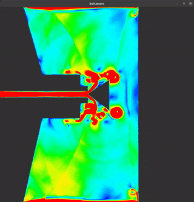

# Lattice Boltzmann simulation

<p align="center">
  
</p>

<p align="center">
  
</p>

<p align="center">
  
</p>

<p align="center">
  
</p>

<p align="center">
  
</p>

### Build the software

This software was tested on:
- Linux Ubuntu 20.10
- NVIDIA 460.39 with CUDA 11.2
- SFML 2.5
- OpenGL 4.6.0

Install dependencies 

```
sudo apt-get install libsfml-dev -y
```

Clone repository

```
git clone https://github.com/longmakesstuff/Lattice-Boltzmann.git
```

Compile

```
cd Lattice-Boltzmann
mkdir build
cd build
cmake ..
make -j24
```

As alternative we can get CLion and let the IDE does the heavy lifting.

### Usage

Commandline interface

```
Lattice Boltzmann Simulation

Usage: ./bin/boltzmann [OPTIONS]

Options:
  -h,--help                   Print this help message and exit
  
  -r,--recording              Record mode on. Default false. If this flag is true, 
                              left mouse click on the window 
                              is needed to start the simulation.
                              
  -f,--freaky                 Freaky colors on. Default false. If this flag is true, 
                              non-traditional colors will be used, else traditional colors.
                              
  -b,--barrier TEXT           Path to png/jpeg/jpg images to import self-made barrier mask file. 
                              Darker areas of the image (average RGB less than 100) will be 
                              detected as barrier.
                              
  -x,--width UINT             Width of the application. (Default 1000).
  
  -y,--height UINT            Height of the application. (Default 1000). Should be at most 1000.

  -v,--verbose                Verbosity for benchmarking. Default false.
```

Keyboard shortcuts in application

```
0 - Display flow's curl (default)
1 - Display flow's speed
2 - Display horizontal velocity
3 - Display vertical velocity
4 - Display probability density
+ - More contrast
- - Fewer contrast
UP - Greater omega (read the PDF to know what omega does)
DOWN - Less omega (read the PDF to know what omega does)
RIGHT MOUSE - Switch between tradition colors and non-traditional colors
```