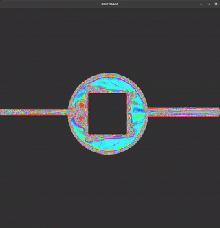

# Lattice Boltzmann simulation

> I am conscious of being only an individual struggling weakly against the stream of time.
> But it still remains in my power to contribute in such a way that, when the theory of gases is revived, not too much
> will have to be rediscovered
> 
> -- <cite>[Ludwid Boltzmann (*1844 in Wien, ✟ in Duino bei Triest)]</cite>

Inspired by the original work of Daniel V. Schroeder[[1]](#1). 

The Lattice Boltzmann is a simple and relatively young method of Computational fluid dynamics. In contrast to traditional 
computational fluid dynamics (CFD) approaches based on the conservation of macroscopic quantities like mass, momentum, and energy, 
the Lattice Boltzmann method (LBM) models the fluid by the kinetics of discrete particles that propagate (streaming step) 
and collide (relaxation step) on a discrete lattice mesh. Due to its particular nature, LBM has several advantages, 
such as dealing with complex boundaries, incorporating microscopic interactions, and parallelization of the algorithm.[[2]](#2)

This project hence aims to demonstrate the easy-to-parallelize property of the algorithm and exploits the graphical processing unit (GPU) 
for computing and rendering purpose, specially for scientific programming. 

CUDA was chosen as the language to go, since the the language was excellently engineered and makes the programming experience very 
comfortable. If the programmer knows his way around C/C++, she or he could get familiar quickly with NVIDIA's proprietary language. The final 
rendering is done with OpenGL. 

Readers with further interest for technical details can take a look at the included `tutorial.pdf` of professor Daniel Schroeder, 
an excellent introduction into the topic.

## Some results

### Have you ever seen a beautiful cow in water?

<p align="center">
  
</p>

### Swimming circles

<p align="center">
  
</p>

### Some self-made structures

<p align="center">
  
</p>

<p align="center">
  
</p>

<p align="center">
  
</p>

## Build the software

This software was tested on:
- Linux Ubuntu 20.10
- NVIDIA 460.39 with CUDA 11.2 for computing purpose.
- OpenGL 4.6.0 for rendering purpose.

Install dependencies 

```
sudo apt-get install libsfml-dev -y
```

Clone repository

```
git clone https://github.com/longmakesstuff/Lattice-Boltzmann.git
```

Compile

```
cd Lattice-Boltzmann
mkdir build
cd build
cmake ..
make -j24
```

As alternative we can get CLion and let the IDE does the heavy lifting.

### Usage

Commandline interface

```
Lattice Boltzmann Simulation

Usage: ./bin/boltzmann [OPTIONS]

Options:
  -h,--help                   Print this help message and exit
  
  -r,--recording              Record mode on. Default false. If this flag is true, 
                              left mouse click on the window 
                              is needed to start the simulation.
                              
  -f,--freaky                 Freaky colors on. Default false. If this flag is true, 
                              non-traditional colors will be used, else traditional colors.
                              
  -b,--barrier TEXT           Path to png/jpeg/jpg images to import self-made barrier mask file. 
                              Darker areas of the image (average RGB less than 100) will be 
                              detected as barrier.
                              
  -x,--width UINT             Width of the application. (Default 1000).
  
  -y,--height UINT            Height of the application. (Default 1000). Should be at most 1000.

  -v,--verbose                Verbosity for benchmarking. Default false.
```

Keyboard shortcuts in application

```
0 - Display flow's curl (default)
1 - Display flow's speed
2 - Display horizontal velocity
3 - Display vertical velocity
4 - Display probability density
+ - More contrast
- - Fewer contrast
UP - Greater omega (read the PDF to know what omega does)
DOWN - Less omega (read the PDF to know what omega does)
RIGHT MOUSE - Switch between tradition colors and non-traditional colors
```

## Some notes and thoughts on the implementation
- Initially the project was planned to run on an Android phone. But it turned out a mobile phone would not have enough
  computation power to run the simulation on high resolution (even with ARM Neon acceleration). So I pivoted, learned 
  some basic CUDA and turned to a desktop application.
- The original implementation was column-major, which is kind of weird (maybe I overseen some details?).
  The current implementation was made row-major.
- The implementation sometimes suffers on some numerical instability problems, which I fail to fix.
- Even when OpenGL is quite awesome and low level, I would not want to use this library in the future anymore. At least 
not in combination with SFML.
- The CUDA scheduling is currently done not that effectively, hence height of the application can not be larger than 1024.

## References

<a id="1">[1]</a>
https://physics.weber.edu/schroeder/javacourse/LatticeBoltzmann.pdf (2012).
Professor Daniel V. Schroeder - Course Physics 3300 - Weber State University.

<a id="2">[2]</a>
https://www-m2.ma.tum.de/bin/view/Allgemeines/MA5344SS17 (2011).
Lattice Boltzmann methods MA5344 - Technical University München.